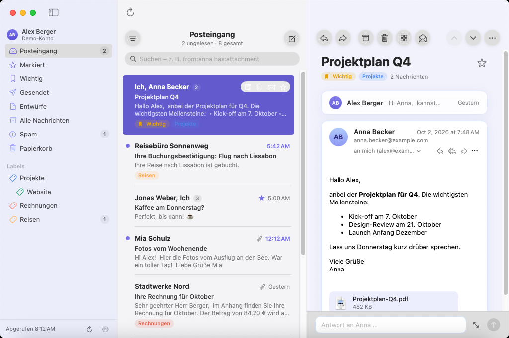
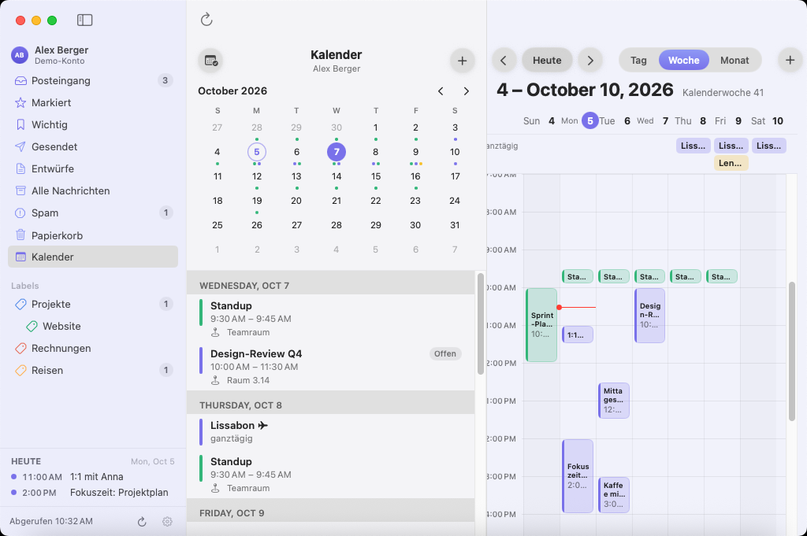

# MailMeG

**MailMeG** steht für **Mail Me Google Mail**: ein nativer Gmail-Client für macOS (SwiftUI, AppKit und WebKit), ohne Web-Wrapper.
MailMeG greift direkt über die [Gmail REST API](https://developers.google.com/gmail/api) auf dein Postfach zu
und nicht über IMAP und nicht über eine eingebettete gmail.com-Seite.

## Funktionen



**Ohne Konto ausprobieren:** Im Willkommensbildschirm öffnet „Erst mal ohne Konto ausprobieren“ ein Demo-Postfach
mit Beispiel-E-Mails, Kalender und Einladung.

### Postfach und Lesen

- **Mehrere Gmail-Konten** gleichzeitig, jeweils mit allen Ordnern: Posteingang, Markiert, Wichtig, Gesendet,
  Entwürfe, Alle Nachrichten, Spam, Papierkorb und eigene Labels (auch verschachtelt), mit Ungelesen-Zählern
- **Konversationsansicht** wie in Gmail: ältere gelesene Nachrichten sind eingeklappt, Labels und
  „Wichtig“ stehen als farbige Chips in Liste und Konversation
- **Suche** mit der vollen Gmail-Syntax (`from:`, `has:attachment`, `older_than:` …) und Filter „Nur ungelesene“
- **Mehrfachauswahl**: ⌘A, ⇧/⌘-Klick oder „Alle auswählen“ (auch über alle Suchergebnisse) und dann gemeinsam
  archivieren, löschen, als gelesen/ungelesen, markiert oder Spam kennzeichnen
- **Aktionen**: Antworten, Allen antworten, Weiterleiten, Archivieren, Löschen, Wiederherstellen, Spam,
  Gelesen/Ungelesen, Markieren, Labels zuweisen; per Hover direkt in der Liste, per Rechtsklick oder Tastatur
- **Vorherige/nächste Konversation** mit ⌥⌘↑/↓ oder den Pfeil-Buttons
- **Empfängerdetails**: die genaue Adresse, an die eine E-Mail ging (auch bei „mich“), plus Von, Antwort an,
  An, Cc, Bcc, Zugestellt an und Datum
- **Quelltext** (⌥⌘U) und **alle Header** (⇧⌘H) in einem eigenen Fenster, mit Filter, Kopieren und Sichern als `.eml`
- **Anhänge und Inline-Bilder** öffnen oder sichern
- **Umlaute und Sonderzeichen** werden richtig angezeigt, auch wenn der Absender einen falschen Zeichensatz angibt

### Schreiben

- **Rich-Text-Editor**: Fett, Kursiv, Unterstrichen, Durchgestrichen, Aufzählungen, nummerierte Listen, Links,
  Schriftgröße und Farbe – verschickt als HTML mit Textalternative
- **Absender wählen**: alle in Gmail unter „Senden als“ hinterlegten Adressen; Antworten gehen automatisch von der
  Adresse raus, an die die E-Mail ging
- **Signaturen aus Gmail**, auch bei Antworten, und beim Absenderwechsel automatisch getauscht
- **Antwort über oder unter dem Zitat** (einstellbar), Antworten landen im richtigen Gmail-Thread
- **Schnellantwort** direkt unter der Konversation (⌘↩ sendet)
- **Entwürfe** werden beim Schreiben automatisch in Gmail gesichert (⌘S sofort) und lassen sich in MailMeG,
  im Web oder auf dem Handy weiterbearbeiten
- **Anhänge** per Button; Weiterleitungen übernehmen die Anhänge der Original-E-Mail

### Google Drive

- **Große Dateien und ZIPs als Drive-Link** über den Button „Google Drive“, mit Fortschrittsanzeige
- **Automatisch über Drive**, wenn Anhänge die E-Mail über Gmails Größenlimit bringen würden oder Gmail den
  Dateityp sperrt (z. B. `.dmg`, `.exe`, `.iso`)
- **Freigabe** für „Jeder mit dem Link“ oder „Nur Empfänger“; die Dateien liegen im Drive-Ordner „MailMeG-Anhänge“
- MailMeG nutzt nur die Berechtigung `drive.file` und sieht damit ausschließlich die Dateien, die es selbst hochlädt

### Google Kalender



- **Kalender als eigener Tab** neben „Mail“ (⌘1 / ⌘2) über die ganze Fensterbreite, mit **Tages-, Wochen-,
  Monats- und Agenda-Ansicht** in den Farben deiner Google-Kalender und **Terminsuche** (⌘F)
- **Alle Konten in einem Kalender**: Mini-Monat, Kalender jedes Kontos zum Ein- und Ausblenden und
  **„Wartet auf deine Antwort“** mit offenen Einladungen
- Mehrtägige Termine über mehrere Tage, offene Einladungen gestrichelt, Abwesenheiten schraffiert, Arbeitsort
  (z. B. Homeoffice) neben dem Datum
- **„Heute“** unten in der Seitenleiste: die restlichen Termine des Tages auf einen Blick
- **Termine anlegen** (⌥⌘N), auch **direkt aus einer E-Mail** (⌥⌘E) mit Betreff und Beteiligten als Gäste
- **Termine bearbeiten, löschen und per Drag & Drop verschieben** (15-Minuten-Schritte, in der Woche auch auf
  andere Tage); Gäste werden auf Wunsch informiert
- **Einladungen in E-Mails** als Karte mit Datum, Ort und Zusagen/Vielleicht/Absagen
- **Termindetails** mit Ort, Google-Meet-Link, Teilnehmern und ihren Antworten

### Mitteilungen und Abruf

- **Neue E-Mails** über die Gmail-History-API; **Abrufintervall** einstellbar von 30 Sekunden bis 1 Stunde
  oder nur manuell (⇧⌘N), letzte Abrufzeit in der Seitenleiste
- **macOS-Mitteilungen**: Klick öffnet die Konversation; Antworten, Als gelesen markieren und Archivieren direkt
  in der Mitteilung
- **Dock-Symbol mit Zähler** ungelesener E-Mails, sofort aktualisiert (abschaltbar)

### Design und Bedienung

- **Native macOS-App** (SwiftUI, AppKit, WebKit) im Stil von Airmail: Glas-Oberflächen, runde Buttons,
  aufgeräumte Liste (Avatare optional), Hell- und Dunkelmodus
- **Deutsch und Englisch**, je nach Systemsprache
- **Tastaturkürzel** wie in Apple Mail (siehe unten)

### Datenschutz und Sicherheit

- MailMeG spricht **direkt mit Google** – kein eigener Server, kein IMAP, keine eingebettete gmail.com-Seite
- **Anmeldung per Google OAuth (PKCE)** im System-Anmeldefenster; MailMeG sieht dein Passwort nie
- **Tokens im macOS-Schlüsselbund**, die App läuft in der macOS-Sandbox
- **Sichere HTML-Darstellung**: JavaScript ist aus, externe Inhalte (Tracking-Pixel) sind blockiert und lassen
  sich per Klick oder Einstellung laden; Links öffnen im Browser

### Tastaturkürzel

| Kürzel | Aktion | Kürzel | Aktion |
|---|---|---|---|
| ⌘N | Neue E-Mail | ⌥⌘N | Neuer Termin |
| ⌘R | Antworten | ⇧⌘R | Allen antworten |
| ⇧⌘F | Weiterleiten | ⌘↩ | Senden |
| ⌃⌘A | Archivieren | ⌘⌫ | In den Papierkorb |
| ⇧⌘U | Gelesen/Ungelesen | ⇧⌘L | Markieren |
| ⇧⌘J | Als Spam melden | ⇧⌘N | Neue E-Mails abrufen |
| ⌥⌘↑ / ⌥⌘↓ | Vorherige/nächste Konversation | ⌘1 / ⌘2 | Mail / Kalender |
| ⌥⌘E | Termin aus E-Mail | ⌥⌘U / ⇧⌘H | Quelltext / Header |
| ⌘A | Alle in der Liste auswählen | ⌥⌘A | Alle Ergebnisse auswählen |
| ⌘S | Entwurf sichern | ⌘B / ⌘I / ⌘U / ⌘K | Fett / Kursiv / Unterstrichen / Link |

## Installation (fertige DMG, ohne Xcode)

1. **[MailMeG.dmg herunterladen](https://github.com/gummipunkt/mailmeg/releases/latest/download/MailMeG.dmg)**
   (aktuelle stabile Version, Universal: Apple Silicon und Intel, macOS 14 oder neuer).
   Alle Versionen stehen unter [Releases](https://github.com/gummipunkt/mailmeg/releases), den neuesten
   Entwicklungsstand gibt es als [Development-Build](https://github.com/gummipunkt/mailmeg/releases/download/nightly/MailMeG.dmg).
2. DMG öffnen und **MailMeG** in den Ordner **Programme** ziehen.
3. **Erster Start:** Die App ist nicht mit einem kostenpflichtigen Apple-Entwicklerzertifikat signiert
   und nicht notarisiert, deshalb blockiert macOS sie beim ersten Öffnen. So gibst du sie frei:
   - MailMeG einmal per Doppelklick öffnen und die Warnung mit *Fertig* schließen.
   - *Systemeinstellungen → Datenschutz & Sicherheit* öffnen, nach unten scrollen und bei
     „MailMeG wurde blockiert“ auf **Dennoch öffnen** klicken.

   Alternativ im Terminal: `xattr -dr com.apple.quarantine /Applications/MailMeG.app`
4. Beim ersten Start fragt MailMeG nach deiner **Google-OAuth-Client-ID**, siehe Abschnitt 1.

Nach einem Update kann macOS einmalig fragen, ob MailMeG auf den Schlüsselbund-Eintrag zugreifen darf.
Dann *Immer erlauben* wählen.

## Voraussetzungen zum selbst Bauen

- macOS 14 (Sonoma) oder neuer
- Xcode 15.3 oder neuer (die Command Line Tools reichen nicht)
- [XcodeGen](https://github.com/yonaskolb/XcodeGen): `brew install xcodegen`
- Ein eigenes Google-Cloud-Projekt mit OAuth-Client (kostenlos, siehe unten)

## 1. Google-Cloud-Projekt einrichten (einmalig, ca. 5 Minuten)

Google erlaubt Gmail-Zugriff nur über einen registrierten OAuth-Client. Für die private Nutzung legst du ihn selbst an:

1. Öffne die [Google Cloud Console](https://console.cloud.google.com/) und lege ein **neues Projekt** an, z. B. „MailMeG“.
2. **APIs aktivieren**: *APIs & Dienste → Bibliothek → „Gmail API“ → Aktivieren*, danach genauso
   **„Google Calendar API“** (Kalender) und **„Google Drive API“** (große Dateien als Drive-Link senden).
3. **OAuth-Zustimmungsbildschirm** (*Google Auth Platform*):
   - *Branding*: App-Name „MailMeG“ und deine E-Mail-Adresse eintragen.
   - *Zielgruppe*: Nutzertyp **Extern** wählen. Unter *Testnutzer* deine Gmail-Adresse(n) hinzufügen.
   - *Datenzugriff* (optional): die Bereiche `…/auth/gmail.modify`, `…/auth/calendar.readonly`,
     `…/auth/calendar.events` und `…/auth/drive.file` hinzufügen.
4. **OAuth-Client anlegen**: *Clients → Client erstellen*
   - Anwendungstyp: **iOS**. Google verwendet diesen Typ auch für macOS-Apps, er braucht kein Client-Secret.
   - Bundle-ID: `de.mailmeg.app`
   - Die angezeigte **Client-ID** kopieren (`…apps.googleusercontent.com`).

> **Wichtig, Token-Laufzeit:** Solange die App im Google-Projekt im Status *Testen* ist, laufen Refresh-Tokens
> nach **7 Tagen** ab, und du musst dich dann neu anmelden (MailMeG zeigt dafür „Erneut anmelden“).
> Das umgehst du, indem du unter *Zielgruppe* auf **„App veröffentlichen“** klickst. Für den Eigengebrauch
> ist keine Google-Verifizierung nötig. Beim Login erscheint dann einmalig der Hinweis „Google hat diese App
> nicht überprüft“, über *Erweitert → Weiter zu MailMeG* geht es weiter.
> Mit einem Google-Workspace-Konto kannst du stattdessen den Nutzertyp *Intern* wählen.

## 2. Selbst bauen (optional)

```bash
git clone <dieses Repo> && cd mailmeg

# optional: Client-ID fest einbauen (die Datei ist git-ignoriert)
echo 'GOOGLE_CLIENT_ID = 1234567890-abc.apps.googleusercontent.com' > Config/Secrets.xcconfig

make open        # erzeugt Mailmeg.xcodeproj mit XcodeGen und öffnet Xcode
```

In Xcode das Schema **MailMeG** wählen und mit ⌘R starten. Ohne `Secrets.xcconfig` fragt die App beim
ersten Start nach der Client-ID.

Weitere Befehle:

```bash
make test        # Unit-Tests der MailmegKit-Bibliothek
# UI-Tests (klicken sich im Demo-Modus durch die App): in Xcode ⌘U
make build       # Release-Build nach build/Build/Products/Release/MailMeG.app
```

Jeder Push baut die App außerdem per GitHub Actions auf macOS, führt Unit- und UI-Tests aus und erzeugt
`MailMeG.dmg`. Pushes auf `main` aktualisieren den
[Development-Build](https://github.com/gummipunkt/mailmeg/releases/tag/nightly).

## Screenshots für die Website

Beispielbilder des Demo-Postfachs (Deutsch/Englisch, hell/dunkel: Posteingang, Kalender in Woche und Monat,
Einladung, Verfassen, Header, Einstellungen) liegen in
`Design/Screenshots/` und werden bei jedem Push von der CI unter
`https://github.com/gummipunkt/mailmeg/releases/download/screenshots/landing-de-inbox-light.png` usw. aktualisiert.
Die CI hat nur ein 1024×768-Display; Retina-Bilder in doppelter Auflösung erzeugt `make screenshots` auf dem eigenen Mac.

## Versionen und Releases

Die Versionsnummer steht an genau einer Stelle: `MARKETING_VERSION` in `Config/Mailmeg.xcconfig`.
Die Build-Nummer setzt die CI automatisch (fortlaufende Nummer des Workflow-Laufs). Beides zeigt die App
unter *MailMeG → Über MailMeG* und in den Einstellungen.

Neue Version veröffentlichen:

1. `MARKETING_VERSION` in `Config/Mailmeg.xcconfig` erhöhen, z. B. auf `1.1.0`.
2. In `CHANGELOG.md` einen Abschnitt `## [1.1.0] – Datum` ergänzen.
3. Nach `main` pushen.

Die CI merkt, dass es für `v1.1.0` noch kein Release gibt, legt Tag und Release „MailMeG 1.1.0“ an und hängt
`MailMeG.dmg` und `MailMeG-1.1.0.dmg` an. Die Release-Notizen kommen aus dem CHANGELOG. Alternativ löst auch
ein gepushter Tag `v1.1.0` das Release aus. Der Tag muss dann zu `MARKETING_VERSION` passen.

## Sprache

MailMeG gibt es auf Deutsch und Englisch. Die App folgt der Reihenfolge unter
*Systemeinstellungen → Allgemein → Sprache & Region*. Steht Deutsch vor Englisch, ist die Oberfläche deutsch.

## Roadmap

- Fester OAuth-Client in der App, damit niemand ein eigenes Google-Cloud-Projekt braucht
  (setzt Googles Prüfung der App voraus)
- Signierung und Notarisierung mit einem Apple-Developer-Zertifikat
- Offline-Cache und Delta-Sync über `history.list`
- Mehrfachauswahl in der Liste, Labels per Drag & Drop
- Gmail-Kategorien (Allgemein, Werbung, Soziale Netzwerke …)

## English

MailMeG (“Mail Me Google Mail”) is a native Gmail client for macOS (SwiftUI) that talks to the Gmail REST API directly instead of
wrapping the Gmail website. The interface is available in English and German and follows your macOS language
order.

**Features:** multiple Gmail accounts with all folders and labels · Gmail-style conversations with label chips ·
full Gmail search syntax · archive, delete, spam, star, labels, read/unread · exact recipient details, message source
and all headers · rich text editor · Gmail “Send mail as” addresses and signatures · reply above or below the quote ·
quick reply · drafts synced with Gmail · large files, ZIPs and blocked file types sent as Google Drive links ·
Google Calendar with day, week and month view, today list, invitations with Accept/Maybe/Decline, events created
from emails, edited, deleted and moved by drag and drop · macOS notifications with actions · unread count on the Dock
icon · configurable fetch interval · Airmail-style glass design with light and dark mode · Apple Mail keyboard shortcuts ·
OAuth sign-in, tokens in the keychain, sandboxed app, remote content blocked by default.

1. Download **[MailMeG.dmg](https://github.com/gummipunkt/mailmeg/releases/latest/download/MailMeG.dmg)**
   (universal, macOS 14 or later) and drag MailMeG into *Applications*.
2. The app is not notarized: open it once, then choose *System Settings → Privacy & Security → Open Anyway*
   (or run `xattr -dr com.apple.quarantine /Applications/MailMeG.app`).
3. Create your own Google Cloud OAuth client of type **iOS** (bundle ID `de.mailmeg.app`) with the Gmail API, the
   Google Calendar API and the Google Drive API enabled, paste the client ID on first launch and sign in. Section 1 above describes every step. Or try the
   demo mailbox first.

## Impressum

© 2026 Patrick Walter
Kontakt / Contact: [www.gummipunkt.eu](https://www.gummipunkt.eu) · [mailmeg@gummipunkt.eu](mailto:mailmeg@gummipunkt.eu)
